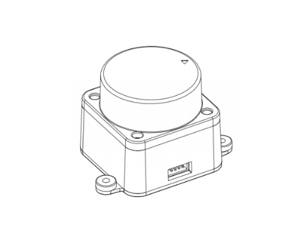

# Tutorial on lidar LD19
LD19 is a lowcost lidar that we (LudovaTech) used to the Robocup Junior competition. We find out that it works very well for our needs but that there was no good documentation or tutorial on the web. We succed to make it work after some long days of work. Here is how we did it :

> [!NOTE]
> This is not an official documentation.
>
> All this documentation and code are licensed under CC BY-SA 4.0, with the exception of images and other files.

## Overview

TODO

# Links

* [What seems to be the official documentation](https://wiki.youyeetoo.com/en/Lidar/D300)
* [A better documentation.](https://www.elecrow.com/download/product/SLD06360F/LD19_Development%20Manual_V2.3.pdf) [(local version if the website remove the document)](./documents/LD19_Development_Manual_v2.5.pdf)

<a property="dct:title" rel="cc:attributionURL" href="https://github.com/LudovaTech/lidar-LD19-tutorial">LD19-tutorial</a> (only the text and code of this document, not the images or the other files) by <a rel="cc:attributionURL dct:creator" property="cc:attributionName" href="https://github.com/LudovaTech">LudovaTech (D'Artagnant)</a> is licensed under <a href="https://creativecommons.org/licenses/by-sa/4.0/?ref=chooser-v1" target="_blank" rel="license noopener noreferrer" style="display:inline-block;">CC BY-SA 4.0</a>
