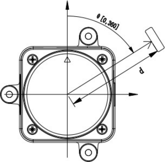

# Tutorial on lidar LD19

LD19 is a lowcost lidar that we (LudovaTech) used to the Robocup Junior competition. We find out that it works very well for our needs but that there was no good documentation or tutorial on the web. We succed to make it work after some long days of work. Here is how we did it :

> [!NOTE]
> This is not an official documentation.
>
> All this documentation and code are licensed under CC BY-SA 4.0, with the exception of images and other files.

## Overview


The LD19 lidar utilizes Direct Time-of-Flight (DTOF) technology, which measures the time interval between emitting and receiving a signal. According to the manufacturer’s documentation, the LD19 can perform up to 5,000 measurements per second.

> [!NOTE]
> In our application, we observed that one complete rotation of the lidar takes approximately 130 milliseconds, resulting in around 600 measurement points per loop.

## Communication interface

You can use a `JST ZH 4-pin` connector to link the LiDAR to other components, facilitating both power supply and data reception. The interface details are outlined in the table below:

From left to right, holding the lidar with the circular part facing upwards.

| Name and Type |  Voltage  |   Comments   |
| :------------ | :-------: | :----------- |
| **Tx** (output UART), lidar data output at `230400` baud rate | 0V - 3.5V </br> typical: 3.3V | This lidar only sends data, not receives it, hence the absence of an Rx port. |
| **PWM** (input), control the speed of the built-in motor, the current lidar speed is indicated in the data sent | 0V - 3.3V | If manual control of the lidar speed is not required, the designated pin can be set to ground (GND) upon initiation of the lidar device and maintained in this state throughout its operation. (More informations on *manual* speed control in the [real documentation](#links))|
| **GND** (power supply) | 0V | - |
| **5V** (power supply) | 4.5V - 5.5V </br> typical: 5V | - |

The LD19 uses UART protocol for data communication with the following settings:

- **Baud Rate:** 230400
- **Data Length:** 8 bits
- **Stop Bit:** 1
- **Parity:** None
- **Flow Control:** None

> [!TIP]
> For Arduino users, simply set the baud rate to `230400`. The other parameters are set to the correct values by default.

> [!IMPORTANT]
> The Lidar LD19 begins transmitting measurement data as soon as its rotation stabilizes, which typically takes two to three seconds. There is no need to send any commands to initiate this process, and in fact, you cannot send any commands to do so.

## Data protocol

### Data packet format

The LD19 uses one-way communication. Once it is operating stably, it begins to send measurement data packets automatically, without requiring any commands. There is 12 points per packet. The format of these measurement packets is illustrated in the table below.

|  Name  | Length | Type or Value | Description |
| :----: | :----: | :-----------: | :---------- |
| Header | 1 Byte | Always `0x54` | Indicating the start of the data packet |
| VerLen | 1 Byte | Always `0x2C` | The upper three bits of the byte specify the packet type, which is currently set to 1. The lower five bits represent the number of measurement points in a packet, which is fixed at 12. |
| Speed  | 2 Bytes | [least significant bit][LSB] before, </br> *unit: degrees per second* | Indicate the speed of the lidar |
| Start Angle | 2 Bytes | [least significant bit][LSB] before, </br> *unit: 0.01 degrees* | Indicate the starting angle of the data packet point |
| **Data** | 3 * 12 Bytes | ... | Please refer to the [next section](#understanding-data-packet) for further details. |
| End angle | 2 Bytes | [least significant bit][LSB] before, </br> *unit: 0.01 degrees* | Indicate the end angle of the data packet point |
| Timestamp | 2 Bytes | [least significant bit][LSB] before, </br> *unit: milliseconds*, </br> Reset to zero upon reaching `30000` | Indicating the timestamp value of the data packet |
| CRC check | 1 Bytes | Verification of all previous data *except itself* | Verifies data transfer for accuracy and completeness, ensuring error-free results. |

> [!IMPORTANT]
> We receive initial and final angles for every set of 12 points. The documentation advises using linear interpolation to determine the angles for each individual point. For detailed implementation steps, refer to the [Implementation section](#Implementation). (Don't worry, it's very simple.)

### Understanding data packet

Each of the 12 mesurement points per packet is composed of 2 values :

|   Name   | Length  | Type or Value | Description |
| :------: | :-----: | :-----------: | :---------- |
| Distance | 2 Bytes | [least significant bit][LSB] before, </br> *unit: mm* | The distance to the detected point |
| Intensity | 1 Byte | reflects the light reflection intensity | As the intensity increases, the signal intensity value also increases; conversely, as the intensity decreases, the signal intensity value decreases. For a white object within 6 meters, the typical signal strength value is approximately 200. |

> [!IMPORTANT]
> The documentation advises using linear interpolation to determine the angles for each individual point. For detailed implementation steps, refer to the [Implementation section](#implementation). (Don't worry, it's very simple.)

> [!NOTE]
> The LD19 employs a left-handed coordinate system with the rotation center at the origin. The front of the sensor is designated as the zero-degree direction, and the rotation angle increases clockwise, as illustrated in the figure below. </br>
> 

## Implementation

### Linear Interpolation

Linear interpolation is in this case a method of estimating values that lie between two known values. Here, it assumes that all points are at the same distance from each other.
All you need to do is :

- Calculate the distance `angleStep` between each point : `(endAngle - startAngle) / nbr_points`. `nbr_points` is always equal to 12 with this lidar.
- calculate the angle for point `n` : `startAngle + (angleStep * n)`
- In reality, the calculations are slightly more complex than indicated in the documentation, particularly to handle the transition from 359° to 0°.

Here is our C++ implementation, which includes the 359° - 0° transition :

```c++
// Calculates the step size between startAngle and endAngle (in tenths of a degree),
// divided by lenMinusOne, which represents the number of steps minus one.
// Assumes angles are within 0 to 3599 (representing 0.0° to 359.9°).
uint16_t angleStep(uint16_t startAngle, uint16_t endAngle, unsigned int lenMinusOne) {
  if (startAngle <= endAngle) {
    return (endAngle - startAngle) / lenMinusOne;
  } else {
    return (36000 + endAngle - startAngle) / lenMinusOne;
  }
}

// Calculates the angle (in tenths of a degree) corresponding to a given step index,
// starting from startAngle, with each step being step tenths of a degree.
// Returns the angle wrapped within 0 to 3599 (representing 0.0° to 359.9°).
uint16_t angleFromStep(uint16_t startAngle, uint16_t step, unsigned int indice) {
  return (startAngle + (step * indice)) % 36000;
}
```

## Links

- [What seems to be the official documentation](https://wiki.youyeetoo.com/en/Lidar/D300)
- [A better documentation.](https://www.elecrow.com/download/product/SLD06360F/LD19_Development%20Manual_V2.3.pdf) [(local version if the website remove the document)](./documents/LD19_Development_Manual_v2.5.pdf)

<p xmlns:cc="http://creativecommons.org/ns#" xmlns:dct="http://purl.org/dc/terms/"><a property="dct:title" rel="cc:attributionURL" href="https://github.com/LudovaTech/lidar-LD19-tutorial">lidar-LD19-tutorial</a> (only the text and code of this document, not the images or the other files) by <a rel="cc:attributionURL dct:creator" property="cc:attributionName" href="https://github.com/LudovaTech">LudovaTech (D'Artagnant)</a> is licensed under <a href="https://creativecommons.org/licenses/by-sa/4.0/?ref=chooser-v1" target="_blank" rel="license noopener noreferrer" style="display:inline-block;">CC BY-SA 4.0</a></p>

[LSB]: https://en.wikipedia.org/wiki/Bit_numbering